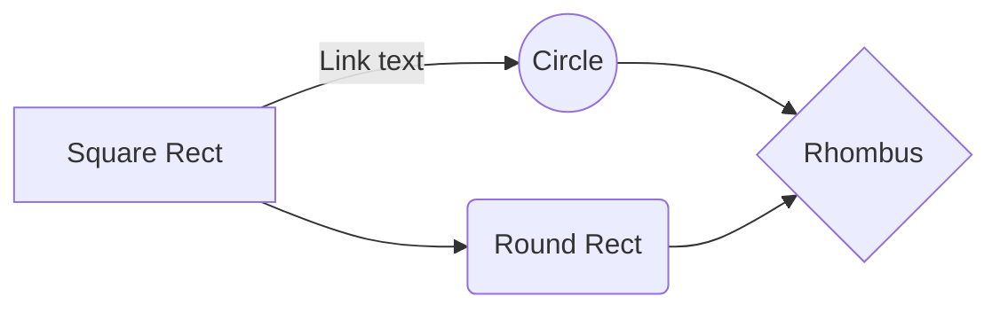

# Mobon Advertiser 2.0 (Rebuild)

## System

#### Inbound Proxy
[![](https://mermaid.ink/img/eyJjb2RlIjoiZ3JhcGggTFJcbiAgJSUgZGVmaW5lIG9iamVjdFxuICBVc2VyKEF1ZGllbmNlKVxuICBzdWJncmFwaCBETVpcbiAgICBMNCgodGsubWVkaWFjYXRlZ29yeS5jb208YnIvPmFwaS5tZWRpYWNhdGVnb3J5LmNvbTxici8-Y2RuLm1lZGlhY2F0ZWdvcnkuY29tPGJyLz48YnIvPlZJUCA6IDExOS4yMDUuMjM4LjEwNCkpXG4gICAgUHJveHkwMVtNUEstV0VCLTAxPGJyLz48YnIvPlJJUCA6IDExOS4yMDUuMjM4LjEwNSA6IDEwLjI1MS4wLjE4MF1cbiAgICBQcm94eTAyW01QSy1XRUItMDI8YnIvPjxici8-UklQIDogMTE5LjIwNS4yMzguMTA2IDogMTAuMjUxLjAuMTgxXVxuICBlbmRcbiAgc3R5bGUgRE1aIGZpbGw6bm9uZSxzdHJva2U6IzMzMyxzdHJva2Utd2lkdGg6MnB4XG4gIHN1YmdyYXBoIEt1YmVybmV0ZXNcbiAgICBzdWJncmFwaCBNUEstQ2x1c3RlclxuICAgICAgR2F0ZXdheSgoU2VydmljZSBHYXRld2F5PGJyLz48YnIvPi0gbW9ib24tZ2F0ZXdheS1hcGktY29tbW9uPGJyLz46IDEwLjI1MS4wLjE4Mzxici8-LSBtb2Jvbi1nYXRld2F5LXNlcnZpY2UtYWdncmVnYXRpb248YnIvPjogMTAuMjUxLjAuMTg0KSlcbiAgICBlbmRcbiAgZW5kXG4gIHN0eWxlIEt1YmVybmV0ZXMgZmlsbDpub25lLCBzdHJva2U6IzMzMyxzdHJva2Utd2lkdGg6MnB4XG4gIHN0eWxlIE1QSy1DbHVzdGVyIGZpbGw6I0ZERjVFNixzdHJva2U6IzMzM1xuICBcbiAgJSUgZGVmaW5lIG9iamVjdCBzdHlsZSBjbGFzc1xuICBjbGFzc0RlZiBwcm94eUNsYXNzIGZpbGw6I2RjZGNkYyxzdHJva2U6IzMzM1xuXG4gIGNsYXNzIEw0IHByb3h5Q2xhc3NcbiAgR2F0ZXdheTo6OnByb3h5Q2xhc3NcblxuICAlJSBkZWZpbmUgbGlua1xuICBVc2VyIC0tV0FOLS0-IEw0XG4gIEw0IC0tPiBQcm94eTAxXG4gIEw0IC0tPiBQcm94eTAyXG4gIFByb3h5MDEgLS0-IEdhdGV3YXlcbiAgUHJveHkwMiAtLT4gR2F0ZXdheVxuICBcbiIsIm1lcm1haWQiOnsidGhlbWUiOiJkZWZhdWx0In19)](#)
<!--
[![](https://mermaid.ink/img/eyJjb2RlIjoiZ3JhcGggTFJcbiAgJSUgZGVmaW5lIG9iamVjdFxuICBVc2VyKEF1ZGllbmNlKVxuICBzdWJncmFwaCBETVpcbiAgICBMNCgodGsubWVkaWFjYXRlZ29yeS5jb208YnIvPmFwaS5tZWRpYWNhdGVnb3J5LmNvbTxici8-Y2RuLm1lZGlhY2F0ZWdvcnkuY29tPGJyLz48YnIvPlZJUCA6IDExOS4yMDUuMjM4LjEwNCkpXG4gICAgUHJveHkwMVtNUEstV0VCLTAxPGJyLz48YnIvPlJJUCA6IDExOS4yMDUuMjM4LjEwNSA6IDEwLjI1MS4wLjE4MF1cbiAgICBQcm94eTAyW01QSy1XRUItMDI8YnIvPjxici8-UklQIDogMTE5LjIwNS4yMzguMTA2IDogMTAuMjUxLjAuMTgxXVxuICBlbmRcbiAgc3R5bGUgRE1aIGZpbGw6bm9uZSxzdHJva2U6IzMzMyxzdHJva2Utd2lkdGg6MnB4XG4gIHN1YmdyYXBoIEt1YmVybmV0ZXNcbiAgICBzdWJncmFwaCBNUEstQ2x1c3RlclxuICAgICAgR2F0ZXdheSgoU2VydmljZSBHYXRld2F5PGJyLz48YnIvPi0gbW9ib24tZ2F0ZXdheS1hcGktY29tbW9uPGJyLz46IDEwLjI1MS4wLjE4Mzxici8-LSBtb2Jvbi1nYXRld2F5LXNlcnZpY2UtYWdncmVnYXRpb248YnIvPjogMTAuMjUxLjAuMTg0KSlcbiAgICBlbmRcbiAgZW5kXG4gIHN0eWxlIEt1YmVybmV0ZXMgZmlsbDpub25lLCBzdHJva2U6IzMzMyxzdHJva2Utd2lkdGg6MnB4XG4gIHN0eWxlIE1QSy1DbHVzdGVyIGZpbGw6I0ZERjVFNixzdHJva2U6IzMzM1xuICBcbiAgJSUgZGVmaW5lIG9iamVjdCBzdHlsZSBjbGFzc1xuICBjbGFzc0RlZiBwcm94eUNsYXNzIGZpbGw6I2RjZGNkYyxzdHJva2U6IzMzM1xuXG4gIGNsYXNzIEw0IHByb3h5Q2xhc3NcbiAgR2F0ZXdheTo6OnByb3h5Q2xhc3NcblxuICAlJSBkZWZpbmUgbGlua1xuICBVc2VyIC0tV0FOLS0-IEw0XG4gIEw0IC0tPiBQcm94eTAxXG4gIEw0IC0tPiBQcm94eTAyXG4gIFByb3h5MDEgLS0-IEdhdGV3YXlcbiAgUHJveHkwMiAtLT4gR2F0ZXdheVxuICBcbiIsIm1lcm1haWQiOnsidGhlbWUiOiJkZWZhdWx0In19)](https://mermaid-js.github.io/mermaid-live-editor/#/edit/eyJjb2RlIjoiZ3JhcGggTFJcbiAgJSUgZGVmaW5lIG9iamVjdFxuICBVc2VyKEF1ZGllbmNlKVxuICBzdWJncmFwaCBETVpcbiAgICBMNCgodGsubWVkaWFjYXRlZ29yeS5jb208YnIvPmFwaS5tZWRpYWNhdGVnb3J5LmNvbTxici8-Y2RuLm1lZGlhY2F0ZWdvcnkuY29tPGJyLz48YnIvPlZJUCA6IDExOS4yMDUuMjM4LjEwNCkpXG4gICAgUHJveHkwMVtNUEstV0VCLTAxPGJyLz48YnIvPlJJUCA6IDExOS4yMDUuMjM4LjEwNSA6IDEwLjI1MS4wLjE4MF1cbiAgICBQcm94eTAyW01QSy1XRUItMDI8YnIvPjxici8-UklQIDogMTE5LjIwNS4yMzguMTA2IDogMTAuMjUxLjAuMTgxXVxuICBlbmRcbiAgc3R5bGUgRE1aIGZpbGw6bm9uZSxzdHJva2U6IzMzMyxzdHJva2Utd2lkdGg6MnB4XG4gIHN1YmdyYXBoIEt1YmVybmV0ZXNcbiAgICBzdWJncmFwaCBNUEstQ2x1c3RlclxuICAgICAgR2F0ZXdheSgoU2VydmljZSBHYXRld2F5PGJyLz48YnIvPi0gbW9ib24tZ2F0ZXdheS1hcGktY29tbW9uPGJyLz46IDEwLjI1MS4wLjE4Mzxici8-LSBtb2Jvbi1nYXRld2F5LXNlcnZpY2UtYWdncmVnYXRpb248YnIvPjogMTAuMjUxLjAuMTg0KSlcbiAgICBlbmRcbiAgZW5kXG4gIHN0eWxlIEt1YmVybmV0ZXMgZmlsbDpub25lLCBzdHJva2U6IzMzMyxzdHJva2Utd2lkdGg6MnB4XG4gIHN0eWxlIE1QSy1DbHVzdGVyIGZpbGw6I0ZERjVFNixzdHJva2U6IzMzM1xuICBcbiAgJSUgZGVmaW5lIG9iamVjdCBzdHlsZSBjbGFzc1xuICBjbGFzc0RlZiBwcm94eUNsYXNzIGZpbGw6I2RjZGNkYyxzdHJva2U6IzMzM1xuXG4gIGNsYXNzIEw0IHByb3h5Q2xhc3NcbiAgR2F0ZXdheTo6OnByb3h5Q2xhc3NcblxuICAlJSBkZWZpbmUgbGlua1xuICBVc2VyIC0tV0FOLS0-IEw0XG4gIEw0IC0tPiBQcm94eTAxXG4gIEw0IC0tPiBQcm94eTAyXG4gIFByb3h5MDEgLS0-IEdhdGV3YXlcbiAgUHJveHkwMiAtLT4gR2F0ZXdheVxuICBcbiIsIm1lcm1haWQiOnsidGhlbWUiOiJkZWZhdWx0In19)
-->

<details>
<summary>view mermaid source</summary>
<div markdown="1">
  
```
graph LR
  %% define object
  User(Audience)
  subgraph DMZ
    L4((tk.mediacategory.com<br/>api.mediacategory.com<br/>cdn.mediacategory.com<br/><br/>VIP : 119.205.238.104))
    Proxy01[MPK-WEB-01<br/><br/>RIP : 119.205.238.105 : 10.251.0.180]
    Proxy02[MPK-WEB-02<br/><br/>RIP : 119.205.238.106 : 10.251.0.181]
  end
  style DMZ fill:none,stroke:#333,stroke-width:2px
  subgraph Kubernetes
    subgraph MPK-Cluster
      Gateway((Service Gateway<br/><br/>- mobon-gateway-api-common<br/>: 10.251.0.183<br/>- mobon-gateway-service-aggregation<br/>: 10.251.0.184))
    end
  end
  style Kubernetes fill:none, stroke:#333,stroke-width:2px
  style MPK-Cluster fill:#FDF5E6,stroke:#333
  
  %% define object style class
  classDef proxyClass fill:#dcdcdc,stroke:#333

  class L4 proxyClass
  Gateway:::proxyClass

  %% define link
  User --WAN--> L4
  L4 --> Proxy01
  L4 --> Proxy02
  Proxy01 --> Gateway
  Proxy02 --> Gateway
```

</div>
</details>

#### L4 > Proxy(Nginx) > Kubernetes(Ingress/Service) >> Kubernetes(Containers)
- 서비스 연속성을 위해 구간별 이중화, 고가용성(HA, High Availability) 시스템을 구성하여 일부에서 결함(fault) 또는 고장(failure)이 발생하여도 정상적 혹은 부분적으로 기능을 수행할 수 있는 결함 감내 시스템(Fault tolerant system)을 구현
- 인프라 네트워크의 보안영역으로 내/외부망 사이에 DMZ를 구성하고 Proxy 서버를 통해 서비스 제공

#### service/data flow

#### 


#### L4 > Proxy(Nginx) > Kubernetes(Ingress/Service) >> Kubernetes(Containers)
- 서비스 연속성을 위해 구간별 이중화, 고가용성(HA, High Availability) 시스템을 구성하여 일부에서 결함(fault) 또는 고장(failure)이 발생하여도 정상적 혹은 부분적으로 기능을 수행할 수 있는 결함 감내 시스템(Fault tolerant system)을 구현
- 인프라 네트워크의 보안영역으로 내/외부망 사이에 DMZ를 구성하고 Proxy 서버를 통해 서비스 제공

#### Kubernetes/Docker
- 컨테이너 실행(Container Runtime) 환경  
  Client: Docker Engine - Community (Version: 19.03.5)


<details>
<summary>view mermaid sample</summary>
<div markdown="1">


[](#)
<!--
[](https://mermaid-js.github.io/mermaid-live-editor/#/edit/eyJjb2RlIjoiZ3JhcGggTFJcbkFbU3F1YXJlIFJlY3RdIC0tIExpbmsgdGV4dCAtLT4gQigoQ2lyY2xlKSlcbkEgLS0-IEMoUm91bmQgUmVjdClcbkIgLS0-IER7UmhvbWJ1c31cbkMgLS0-IERcbiIsIm1lcm1haWQiOnsidGhlbWUiOiJkZWZhdWx0In0sInVwZGF0ZUVkaXRvciI6ZmFsc2V9)
-->


[](#)
<!--
[](https://mermaid-js.github.io/mermaid-live-editor/#/edit/eyJjb2RlIjoiZ3JhcGggVEQ7XG4gICAgQS0tPkI7XG4gICAgQS0tPkM7XG4gICAgQi0tPkQ7XG4gICAgQy0tPkQ7XG4iLCJtZXJtYWlkIjp7InRoZW1lIjoiZGVmYXVsdCJ9LCJ1cGRhdGVFZGl0b3IiOmZhbHNlfQ)
-->

</div>
</details>
