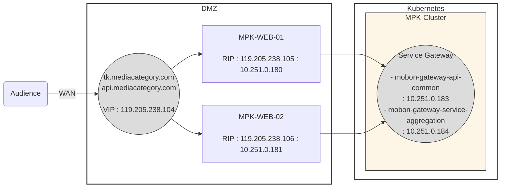

#### mermaid
https://mermaid-js.github.io/mermaid

#### mermaid : live editor
https://mermaid-js.github.io/mermaid-live-editor

`graph directions`  
TB - top bottom  
BT - bottom top  
RL - right left  
LR - left right  
TD - same as TB  

`sample flowchart`  

https://mermaid-js.github.io/mermaid-live-editor/#/edit/eyJjb2RlIjoiZ3JhcGggTFJcbiAgJSUgZGVmaW5lIG9iamVjdFxuICBVc2VyKEF1ZGllbmNlKVxuICBzdWJncmFwaCBETVpcbiAgICBMNCgodGsubWVkaWFjYXRlZ29yeS5jb208YnIvPmFwaS5tZWRpYWNhdGVnb3J5LmNvbTxici8-PGJyLz5WSVAgOiAxMTkuMjA1LjIzOC4xMDQpKVxuICAgIFByb3h5MDFbTVBLLVdFQi0wMTxici8-PGJyLz5SSVAgOiAxMTkuMjA1LjIzOC4xMDUgOiAxMC4yNTEuMC4xODBdXG4gICAgUHJveHkwMltNUEstV0VCLTAyPGJyLz48YnIvPlJJUCA6IDExOS4yMDUuMjM4LjEwNiA6IDEwLjI1MS4wLjE4MV1cbiAgZW5kXG4gIHN0eWxlIERNWiBmaWxsOm5vbmUsc3Ryb2tlOiMzMzMsc3Ryb2tlLXdpZHRoOjJweFxuICBzdWJncmFwaCBLdWJlcm5ldGVzXG4gICAgc3ViZ3JhcGggTVBLLUNsdXN0ZXJcbiAgICAgIEdhdGV3YXkoKFNlcnZpY2UgR2F0ZXdheTxici8-PGJyLz4tIG1vYm9uLWdhdGV3YXktYXBpLWNvbW1vbjxici8-OiAxMC4yNTEuMC4xODM8YnIvPi0gbW9ib24tZ2F0ZXdheS1zZXJ2aWNlLWFnZ3JlZ2F0aW9uPGJyLz46IDEwLjI1MS4wLjE4NCkpXG4gICAgZW5kXG4gIGVuZFxuICBzdHlsZSBLdWJlcm5ldGVzIGZpbGw6bm9uZSwgc3Ryb2tlOiMzMzMsc3Ryb2tlLXdpZHRoOjJweFxuICBzdHlsZSBNUEstQ2x1c3RlciBmaWxsOiNGREY1RTYsc3Ryb2tlOiMzMzNcbiAgXG4gICUlIGRlZmluZSBvYmplY3Qgc3R5bGUgY2xhc3NcbiAgY2xhc3NEZWYgcHJveHlDbGFzcyBmaWxsOiNkY2RjZGMsc3Ryb2tlOiMzMzNcblxuICBjbGFzcyBMNCBwcm94eUNsYXNzXG4gIEdhdGV3YXk6Ojpwcm94eUNsYXNzXG5cbiAgJSUgZGVmaW5lIGxpbmtcbiAgVXNlciAtLVdBTi0tPiBMNFxuICBMNCAtLT4gUHJveHkwMVxuICBMNCAtLT4gUHJveHkwMlxuICBQcm94eTAxIC0tPiBHYXRld2F5XG4gIFByb3h5MDIgLS0-IEdhdGV3YXlcbiAgXG4iLCJtZXJtYWlkIjp7InRoZW1lIjoiZGVmYXVsdCJ9LCJ1cGRhdGVFZGl0b3IiOmZhbHNlfQ
