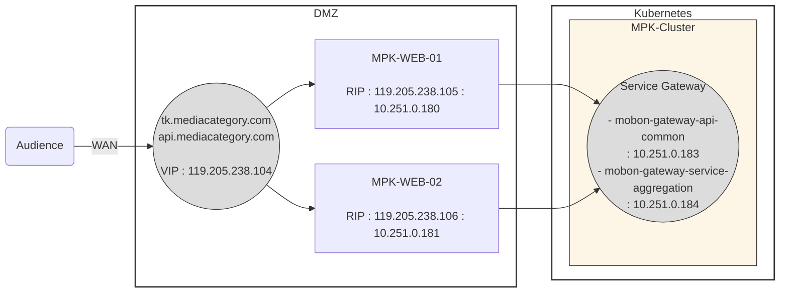

#### mermaid
https://mermaid-js.github.io/mermaid

#### mermaid : live editor
https://mermaid-js.github.io/mermaid-live-editor

`graph directions`  
TB - top bottom  
BT - bottom top  
RL - right left  
LR - left right  
TD - same as TB  

`sample flowchart`  

